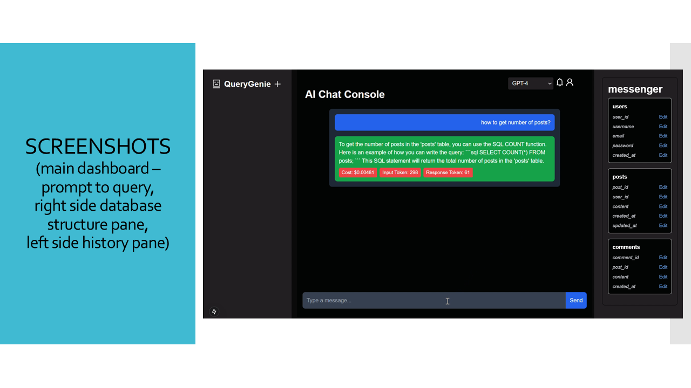

# QueryGenie

**Talk it, query it, done!**

QueryGenie is an advanced tool that converts natural language prompts (both text and voice inputs) to SQL queries. It manages the usage based on token counts and cost incurred, along with detailed analytics for each user profile.

**YouTube Link - [Click here to watch the YouTube video](https://youtu.be/sqjkA5nLixQ)**

**Executive Challenge - "Chat with your data" token utilization and cost monitoring challenge**


## Table of Contents

- [Team Members](#team)
- [Features](#features)
- [Innovation](#innovation)
- [Microsoft Tools](#tools)
- [Installation](#installation)
- [Configuration](#configuration)
- [Usage](#usage)
- [Screenshots](#screenshots)
- [Project Structure](#querygenie-project-structure)
- [Contributing](#contributing)
- [License](#license)

## Team
- RS Kierthana
- Aruthra S
- Arun Pranav A T


## Features

- Converts natural language prompts to SQL queries.
- Supports both text and voice inputs.
- Tracks token counts and cost incurred.
- Provides detailed analytics for each user profile.
- Notifies users when token limit is nearing based on set limits.
- Allows any form of databases to be linked.
- Considers history of the chat when required.

## [Project Documentation (Click)](documents/QueryGenie.pdf)
- Click on the title to view this project presentation saved in the format of pdf.

## Innovation

- **Provides detailed analytics for each user profile** while existing projects concentrates only on natural language prompts to SQL queries.
- **Follows separate notification system** while existing projects lack them.
- **History can be deleted** supporting responsible AI while existing projects could have missed them.
- **SQL Queries generated are read out loud** which supports visually impaired users.
- **Prompts can be given in form of voice too** for those who find it difficult to type.


## Tools

- Azure Database for PostgreSQL (Database)
- Azure OpenAI (AI)
- Azure App Service (Hosting)
- Azure Authentication (Authentication)
- Python (Backend)
- Next.js (JavaScript - Frontend)
- Github Copilot
- Git and Github
- LangChain


## Installation

1. Clone the repository:

    ```sh
    https://github.com/arunpranav-at/NLP-to-SQL.git
    cd NLP-to-SQL
    ```

2. Install the required dependencies:

    ```sh
    pip install -r backend/requirements.txt
    npm install --prefix frontend
    ```

3. Set up the environment variables:

    Copy the `.env` file in both `backend` and `frontend` directories and fill in the required values.

    ```sh
    cp backend/.mock.env backend/.env
    cp frontend/.mock.env frontend/.env
    ```

## Configuration

### Backend

The backend configuration files are located in the `backend/configs` directory.

- `llm_config.py`: Configuration for the language model.
- `postgres_config.py`: Configuration for the PostgreSQL database.

### Frontend

The frontend configuration files are located in the root directory of the `frontend`.

- `next.config.mjs`: Next.js configuration.
- `postcss.config.mjs`: PostCSS configuration.
- `tailwind.config.js`: Tailwind CSS configuration.

## Usage

### Running the Backend

1. Navigate to the `backend` directory:

    ```sh
    cd backend
    ```

2. Start the backend server:

    ```sh
    python server.py
    ```

### Running the Frontend

1. Navigate to the `frontend` directory:

    ```sh
    cd frontend
    ```

2. Start the frontend server:

    ```sh
    npm run dev
    ```

# Screenshots


# QueryGenie Project Structure

## Root Directory
- `.gitignore`
- `LICENSE`
- `README.md`

## Backend Directory
- `.env`
- `.gitignore`
- `.mock.env`
- `requirements.txt`
- `server.py`

### Configs
- `configs/`
  - `__pycache__/`
  - `llm_config.py`
  - `postgres_config.py`

### Models
- `models/`
  - `__pycache__/`
  - `db.py`
  - `message_store.py`
  - `sessions.py`
  - `users.py`

### Routers
- `routers/`
  - `AuthRouter/`
    - `Handlers/`
      - `LoginHandler.py`
      - `SignUpHandler.py`
      - `__init__.py`
    - `__init__.py`
  - `BotRouter/`
    - `Handlers/`
      - `BotHandler.py`
      - `FetchHandler.py`
      - `__init__.py`
    - `DTconverter.py`
    - `prompt.py`
    - `router.py`
  - `ChartRouter/`
    - `__init__.py`

## Documents Directory
- `documents/`
  - `hello.txt`

## Frontend Directory
- `.env`
- `.eslintrc.json`
- `.gitignore`
- `.mock.env`
- `.next/`
- `jsconfig.json`
- `next.config.mjs`
- `package.json`
- `postcss.config.mjs`
- `public/`
- `README.md`
- `tailwind.config.js`

### Frontend Source
- `src/`
  - `app/`
    - `chat/`
      - `[chatId]/`
        - `page.js`
    - `components/`
      - `DatabaseList.js`
      - `DatabasePopup.js`
      - `Profile.js`
      - `Sidebar.js`
    - `context/`
      - `ChatContext.js`
    - `dashboard/`
      - `page.js`
    - `fonts/`
    - `globals.css`
    - `layout.js`
    - `page.js`
    - `userDetails.js`

## Contributing

We welcome contributions! Please follow these steps to contribute:

1. Fork the repository.
2. Create a new branch (`git checkout -b feature-branch`).
3. Make your changes.
4. Commit your changes (`git commit -m 'Add some feature'`).
5. Push to the branch (`git push origin feature-branch`).
6. Open a pull request.

## License

This project is licensed under the MIT License. See the [LICENSE](LICENSE) file for details.

## Presentation Slides




